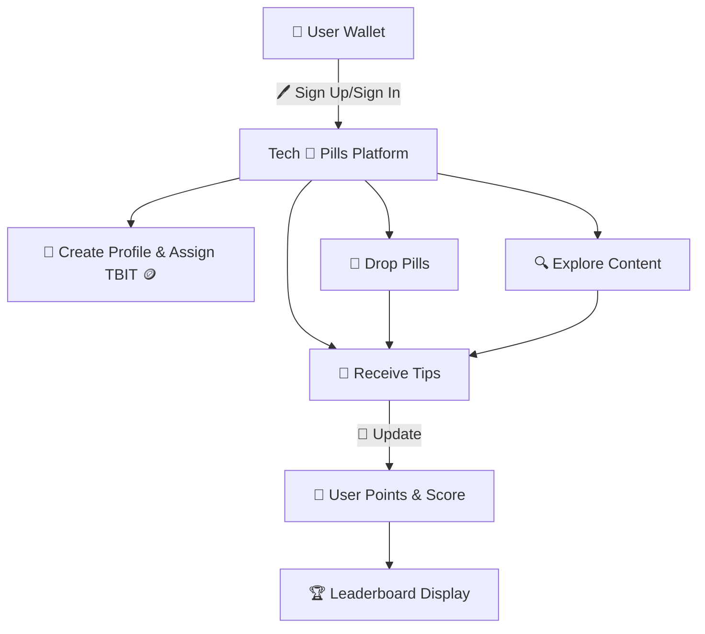
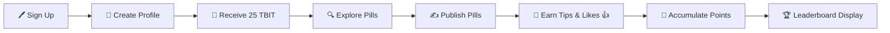

# 🌟 Lens Holiday Hackathon Submission 🌟

## 📛 Project Name
**Tech 💊 Pills**

## 👥 Team Members
|Name        |Role            |Github        |Telegram|
|------------|---------------|---------------|----------------|
|👤 Alex     |Full stack dev      | [padimaster](https://github.com/padimaster)  | Telegram: @padimaster |
|👤 Carlos |Blockchain dev    |  [cijimenez](https://github.com/cijimenez)    | Telegram: @carlos_israelj |
|👤 Gabriela | UI/UX Designer |  [Galix-neko](https://github.com/Galix-neko)  | Telegram: @galixneko |
|👤 Paul | Product Owner/ Blockchain dev |  [0xarcano](https://github.com/0xarcano)   |    Telegram: @Oxarcano |

## 📜 Project Description
**Tech 💊 Pills** is a SocialFi 🌐 platform built on Lens 🧬 Protocol Testnet 🧪 designed to empower tech enthusiasts 💻 to create 🛠️, explore 🧭, and learn 📚 while earning 💰 rewards. The platform is geared towards individuals 👥 who wish to share 🔄 and consume 🍽️ knowledge 📖 in an engaging 🕹️, gamified 🎮 manner. Users can:

- 🖊️ Sign up and sign in using their crypto wallets 💳.
- 👤 Create profiles 🖼️ linked to their wallets.
- ✍️ Publish technology-focused posts 📜, called "💊 Pills."
- 🌍 Explore content 🧾 created by other users.
- 💸 Tip others for their valuable 🏆 content.
- 🪙 Earn TechBites tokens (TBIT) 🤑 as incentives.
- 🔢 Accumulate points 🎯 based on engagement metrics 📊 like likes 👍, tips 💵, and published content 🖋️.
- 🏅 Showcase their scores 🎖️ and avatars 👤 as a reward mechanism 🎁 to motivate participation.

🔮 Future iterations will include 🎥 video uploads, multi-token 🪙 tipping, and structured 🏗️ learning paths.

## 🛠️ Features Implemented for MVP
1. **💳 Wallet Integration**: Users can sign up 🖊️ and sign in via their crypto wallets.
2. **👤 Profiles**: Wallet-linked user profiles are created upon sign-up 📝.
3. **🎁 Initial Rewards**: Users receive 25 TechBites tokens (TBIT) 🪙 upon sign-up as an economic incentive 💵.
4. **🔍 Content Exploration**: Users can browse 🧭 and explore content 🧾 by others.
5. **🖋️ Post Creation**: Users can create 🛠️ and drop "💊 Pills" focused on tech topics 🖥️.
6. **💸 Tipping Mechanism**: Users can tip 💵 content creators 🧑‍🎨 for valuable posts 🏆.
7. **🎮 Gamification**: Profiles accumulate points 🎯 for engagement activities 📊.
8. **🏆 Leaderboard Display**: User scores 🎖️ and avatars 👤 are visible on profiles 🖼️ to incentivize activity 🏅.

## 🏗️ Architecture and Workflow

## 🔄 User Flow

## 🎥 Project overview
[🎬 Pitch video ](https://1drv.ms/v/s!AulCBAJ0X5uKm-hUmuDxKFgRE24vEg?e=nFBmy0)

## 🔗 Source Code Link
[🔧 GitHub Repository](https://github.com/padimaster/holiday-hackathon)

## 🌐 Preview Link
[🌟 Preview the Platform](https://your-platform-preview-link.com)

## 🎥 Demo Video/Slide Deck Link
[🎬 Demo Video](https://your-demo-video-link.com)

## 🖼️ Screenshots

## 🛠️ Troubleshooting
For any questions or issues 🛑, please contact 📬 the Lens developer community via [Telegram 💬](https://t.me/LensProtocolCommunity). Remember to:
- 💬 Ask in public channels.
- 🙏 Respect others and be patient 🕰️ during holiday periods 🎄.

## 📝 Notes
- Submission adheres to the hackathon rules 📜 and is open source 💻.
- The platform integrates Lens Protocol 🧬 and is deployed on the Testnet 🧪.
- All code 💾 and commits align with the guidelines 📋, ensuring validity and eligibility for prizes 🏅.
