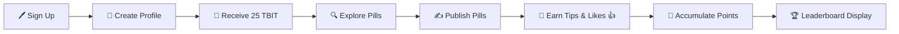

# 🌟 Lens Holiday Hackathon Submission 🌟

## 📛 Project Name

## 👥 Team Members
- 👤 Gabriela    Github: [Galix-neko](https://github.com/Galix-neko)   Telegram: @galixneko
- 👤 Alex        Github: [padimaster](https://github.com/padimaster)   Telegram: @padimaster
- 👤 Carlos      Github: [cijimenez](https://github.com/cijimenez)     Telegram: @carlos_israelj
- 👤 Paul        Github: [0xarcano](https://github.com/0xarcano)       Telegram: @Oxarcano

## 📜 Project Description
**Tech 💊 Pills** is a SocialFi platform built on Lens Protocol Testnet designed to empower tech enthusiasts 💻 to create, explore, and learn while earning 💰 rewards. The platform is geared towards individuals 👥 who wish to share and consume knowledge 📖 in an engaging manner. Users can:

- 🖊️ Sign up and sign in using their crypto wallets.
- 👤 Create profiles linked to their wallets.
- ✍️ Publish technology-focused posts, called "💊 Pills."
- 🌍 Explore content 🧾 created by other users.
- 💸 Tip others for their valuable content.
- 🪙 Earn TechBites tokens (TBIT) as incentives.
- 🔢 Accumulate points based on engagement metrics like likes 👍, tips 💵, and published content 🖋️.
- 🏅 Showcase their scores 🎖️ and avatars 👤 as a reward mechanism 🎁 to motivate participation.

🔮 Future iterations will include 🎥 video uploads, multi-token 🪙 tipping, and structured 🏗️ learning paths.

## 🛠️ Features Implemented for MVP
1. **💳 Wallet Integration**: Users can sign up and sign in via their crypto wallets.
2. **👤 Profiles**: Wallet-linked user profiles are created upon sign-up.
3. **🎁 Initial Rewards**: Users receive 25 TechBites tokens (TBIT) upon sign-up as an economic incentive 💵.
4. **🔍 Content Exploration**: Users can browse and explore content 🧾 by others.
5. **🖋️ Post Creation**: Users can create and drop "💊 Pills" focused on tech topics.
6. **💸 Tipping Mechanism**: Users can tip 💵 content creators 🧑‍🎨 for valuable posts.
7. **🏆 Leaderboard Display**: User scores 🎖️ and avatars 👤 are visible on profiles 🖼️ to incentivize activity 🏅.

## 🏗️ Architecture and Workflow

## 🔄 User Flow

## 🎥 Project overview
[🎬 Pitch video ](https://1drv.ms/v/s!AulCBAJ0X5uKm-hUmuDxKFgRE24vEg?e=nFBmy0)

## 🔗 Source Code Link
[🔧 GitHub Repository](https://github.com/padimaster/holiday-hackathon)

## 🌐 Preview Link
[🌟 Preview the Platform](https://your-platform-preview-link.com)

## 🎥 Demo Video/Slide Deck Link
[🎬 Demo Video](https://your-demo-video-link.com)

## 🖼️ Screenshots!

#### Landing page

---
#### Family Connect Kit
---

---
#### Sign Up
---

---
#### Signed Up
---

---
#### Home
---

---
#### Profile
---

---
#### Writting a post
---

---
#### Preview of post
---

---
#### Published post
---

---
#### Send Tip Form
---

---
#### Create post modal
---

---
