# 🌟 Lens Holiday Hackathon Submission 🌟

## 📛 Project Name
**Tech 💊 Pills**

## 👥 Team Members
- 👤 Gabriela    Github: [Galix-neko](https://github.com/Galix-neko)   Telegram: @galixneko
- 👤 Alex        Github: [padimaster](https://github.com/padimaster)   Telegram: @padimaster
- 👤 Carlos      Github: [cijimenez](https://github.com/cijimenez)     Telegram: @carlos_israelj
- 👤 Paul        Github: [0xarcano](https://github.com/0xarcano)       Telegram: @Oxarcano

## 📜 Project Description
**Tech 💊 Pills** is a SocialFi platform built on Lens Protocol Testnet designed to empower tech enthusiasts 💻 to create, explore, and learn while earning 💰 rewards. The platform is geared towards individuals 👥 who wish to share and consume knowledge 📖 in an engaging manner. Users can:

- 🖊️ Sign up and sign in using their crypto wallets.
- 👤 Create profiles linked to their wallets.
- ✍️ Publish technology-focused posts, called "💊 Pills."
- 🌍 Explore content 🧾 created by other users.
- 💸 Tip others for their valuable content.
- 🪙 Earn TechBites tokens (TBIT) as incentives.
- 🔢 Accumulate points based on engagement metrics like likes 👍, tips 💵, and published content 🖋️.
- 🏅 Showcase their scores 🎖️ and avatars 👤 as a reward mechanism 🎁 to motivate participation.

🔮 Future iterations will include 🎥 video uploads, multi-token 🪙 tipping, and structured 🏗️ learning paths.

## 🛠️ Features Implemented for MVP
1. **💳 Wallet Integration**: Users can sign up and sign in via their crypto wallets.
2. **👤 Profiles**: Wallet-linked user profiles are created upon sign-up.
3. **🎁 Initial Rewards**: Users receive 25 TechBites tokens (TBIT) upon sign-up as an economic incentive 💵.
4. **🔍 Content Exploration**: Users can browse and explore content 🧾 by others.
5. **🖋️ Post Creation**: Users can create and drop "💊 Pills" focused on tech topics.
6. **💸 Tipping Mechanism**: Users can tip 💵 content creators 🧑‍🎨 for valuable posts.
7. **🏆 Leaderboard Display**: User scores 🎖️ and avatars 👤 are visible on profiles 🖼️ to incentivize activity 🏅.

## 🏗️ Architecture and Workflow

```mermaid
graph TD
    A[👛 User Wallet] -->|🖊️ Sign Up/Sign In| B[Tech 💊 Pills Platform]
    B --> C[👤 Create Profile & Assign TBIT token]
    B --> D[🔍 Explore Content]
    B --> E[💊 Drop Pills]
    B --> F[💸 Receive Tips]
    F -->|🔄 Update| G[🎯 User Points & Score]
    G --> H[🏆 Leaderboard Display]
    E --> F
    D --> F
```

## 🔄 User Flow

```mermaid
graph LR
    Start[🖊️ Sign Up] --> Profile[👤 Create Profile]
    Profile --> Reward[🎁 Receive 25 TBIT]
    Reward --> Explore[🔍 Explore Pills]
    Explore --> Publish[✍️ Publish Pills]
    Publish --> Engagement[💸 Earn Tips & Likes 👍]
    Engagement --> Points[🎯 Accumulate Points]
    Points --> Display[🏆 Leaderboard Display]
```

## 🎥 Project overview
[🎬 Pitch video ](https://1drv.ms/v/s!AulCBAJ0X5uKm-hUmuDxKFgRE24vEg?e=nFBmy0)

## 🔗 Source Code Link
[🔧 GitHub Repository](https://github.com/padimaster/holiday-hackathon)

## 🌐 Preview Link
[🌟 Preview the Platform](https://your-platform-preview-link.com)

## 🎥 Demo Video/Slide Deck Link
[🎬 Demo Video](https://your-demo-video-link.com)

## 🖼️ Screenshots

## 🛠️ Troubleshooting
For any questions or issues 🛑, please contact 📬 the Lens developer community via [Telegram 💬](https://t.me/LensProtocolCommunity). Remember to:
- 💬 Ask in public channels.
- 🙏 Respect others and be patient 🕰️ during holiday periods 🎄.

## 📝 Notes
- Submission adheres to the hackathon rules 📜 and is open source 💻.
- The platform integrates Lens Protocol 🧬 and is deployed on the Testnet 🧪.
- All code 💾 and commits align with the guidelines 📋, ensuring validity and eligibility for prizes 🏅.
